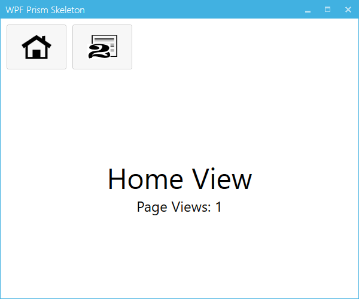

# WPF_Prism_Skeleton
This is a good starting point for taking a look at a Prism MVVM view-based navigation layout in a WPF application.  I'd like to keep this repo as light as possible, so I'm limiting the amount of code I'll include.  I did bring in the Mahapps.Metro NuGet package to help jazz up the UI a little, though.

